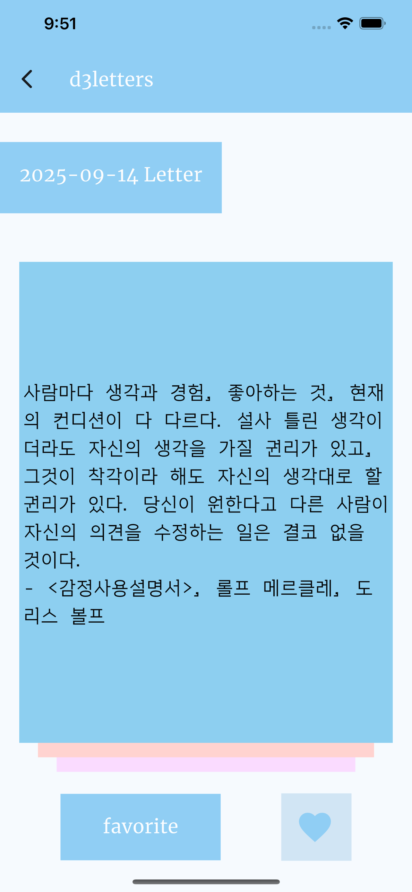

## 🖼️ d3letters, 편지3개

하루에 편지 3개가 오는 앱입니다. 편지는 명언들입니다. 
유명한 문장이 아니라도 제가 마음에 든 문장들도 포함했습니다.

flutter로 구현했고 앱스토어 심사중입니다.

제가 책을 통해서 정말 많은 도움을 받았기 때문에, 다른 사람들에게도 그런 경험을 공유하고 싶습니다. 
제 가치관에 맞는 명언들로 조금은 편향될 수 있지만, 저와 비슷한 사람이라면 공감할 수 있을 것입니다.

